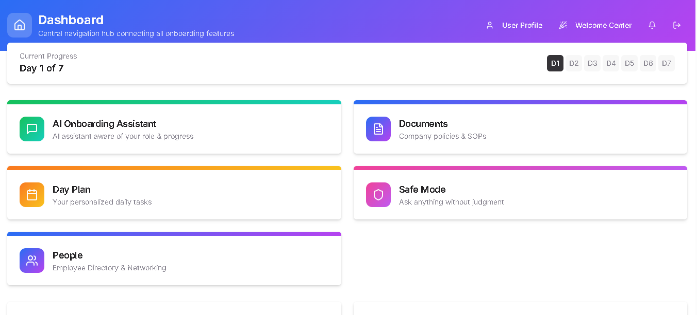

# AI-Powered Employee Onboarding

**Live Demo**: [https://ai-powered-employee-onboarding.vercel.app/](https://ai-powered-employee-onboarding.vercel.app/)

Welcome to the **AI-Powered Employee Onboarding** application! This platform is designed to streamline internal communications, modernize the new joinee onboarding flow, and keep organizational day-to-day operations focused and accessible.

## 🚀 Purpose

When successfully hosted, the AI-Powered Employee Onboarding acts as a unified hub tailored for employees to orient themselves within the company ecosystem. Its primary capabilities include:

- **AI-Driven Onboarding**: An interactive AI chat bot that greets new joinees, assesses their role & department, and dynamically curates their onboarding experience.
- **Dynamic Dashboards**: Centralizing important metrics, outstanding daily tasks, and unread chat notifications.
- **People Directory**: A beautifully crafted colleague repository where employees can discover teammates, view comprehensive profiles (skills, roles, locations, new joinee badges), and effortlessly draft "Coffee Chat" networking emails to them.
- **Internal Messaging (Context Chat)**: Persistent, database-supported messaging channels between colleagues to promote communication across departments seamlessly.
- **Day Plans & Goal Tracking**: Keep track of daily checklists and ongoing projects with integrated persistence.

## 📸 Snapshots

*Replace the placeholders below with live screenshots of your application hosted on Vercel!*
### Welcome Center


### The Dashboard


### People Directory


### User Profile


### Integrated Context Chats


---

## 🛠️ Technology Stack
- **Frontend**: React, TypeScript, Vite
- **Styling**: TailwindCSS, Shadcn/UI Component Library
- **Database & Auth**: Supabase (PostgreSQL)
- **Deployment Strategy**: Vercel

## ⚙️ Getting Started

### Local Development
To run this project locally on your machine:
```bash
# Install dependencies
npm install

# Start the Vite development server
npm run dev
```

### Hosting on Vercel
The repository is primed for continuous deployment on Vercel. 
1. Link your GitHub repository to your Vercel account. 
2. Ensure you have injected your local `.env` variables (like your `VITE_SUPABASE_URL` and `VITE_SUPABASE_ANON_KEY`) into the Vercel Environment Variables console. 
3. Deploy!
